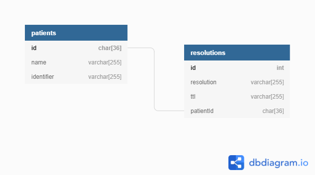

# Appointment API

Appointment API is an API to work with the queue and appointment resolutions.

## Docker

To start the application with storing data in a certain database, go to the api directory, set right configuration in <b>.env</b> file, go back to the root directory and run:

For in app memory storing (both queue and resolutions are stored in app memory):

```bash
docker-compose --profile inmemory up -d
```

For redis storing (one of the data structures is stored in redis, the second either in redis or in app memory):

```bash
docker-compose --profile redis up -d
```

For mysql storing (only supports resolutions, doesn't matter where the queue will be stored (app memory/redis)):

```bash
docker-compose --profile mixed up -d
```

The API server will start on [localhost:8080](http://localhost:8080), the client server will start on [localhost:3000](http://localhost:3000)

To stop the application, in the root directory run:

```bash
docker-compose down
```

## MySQL relations



## Documentation

The documentation for the API routes was made using [Swagger](https://swagger.io/tools/swagger-ui/).

To access the documentation, navigate to the api folder and install all the dependencies.

```bash
npm install
```

Then start the server.

```bash
npm start
```

Then navigate to [http://localhost:8080/api-docs/](http://localhost:8080/api-docs/).
